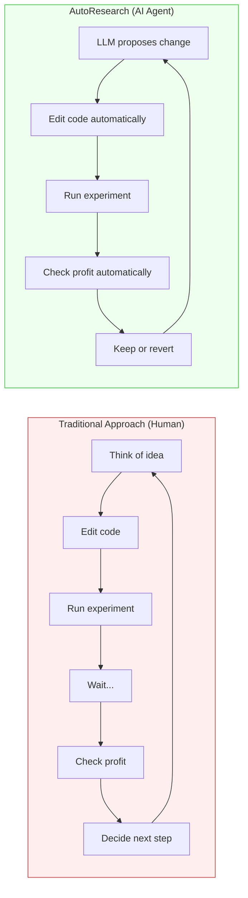
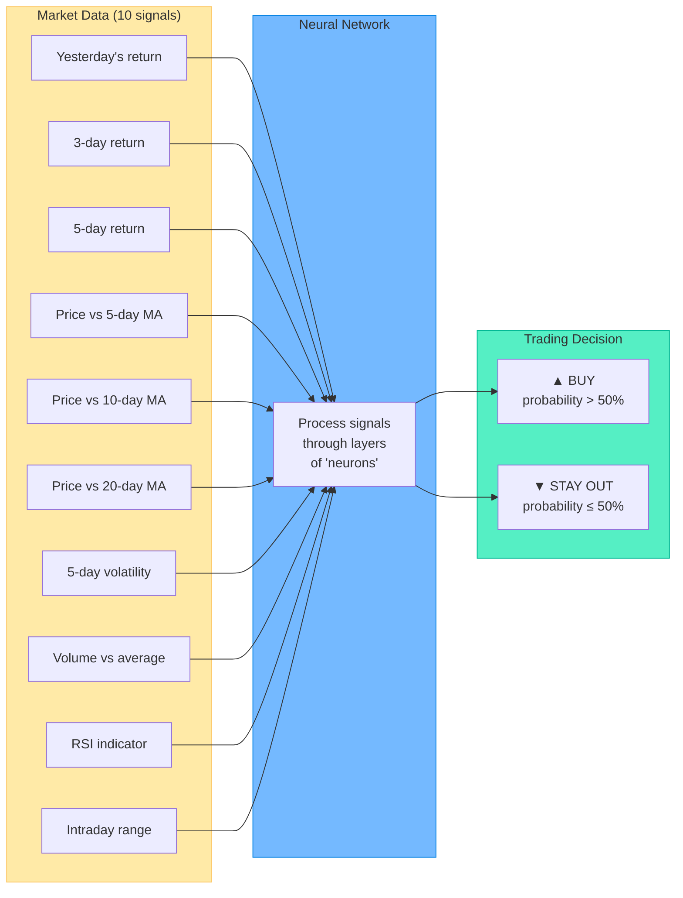
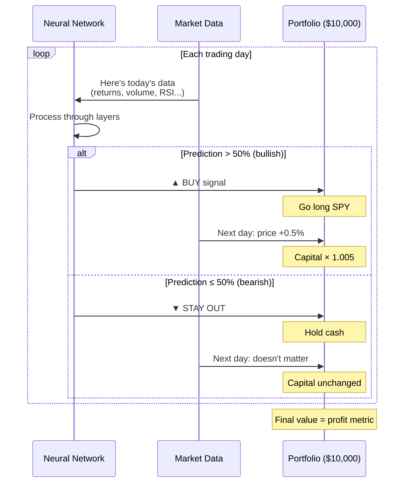
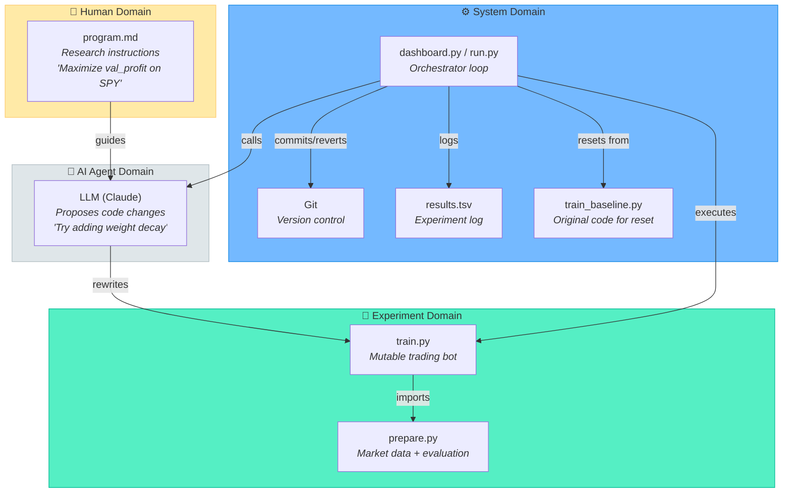
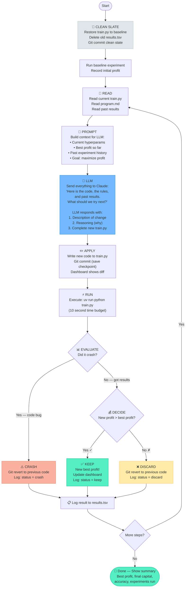
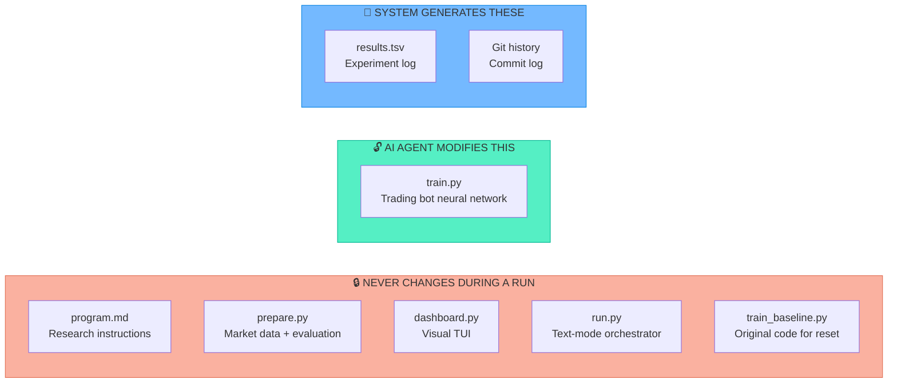
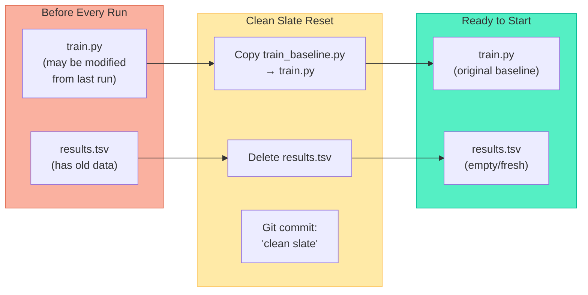
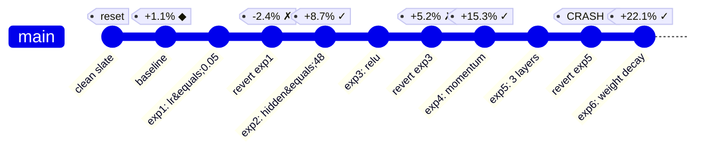
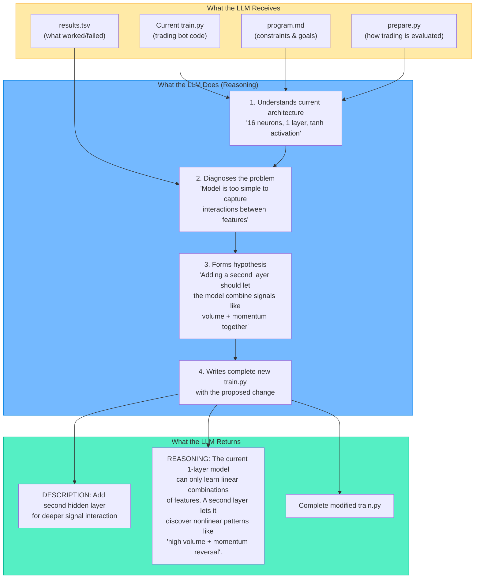
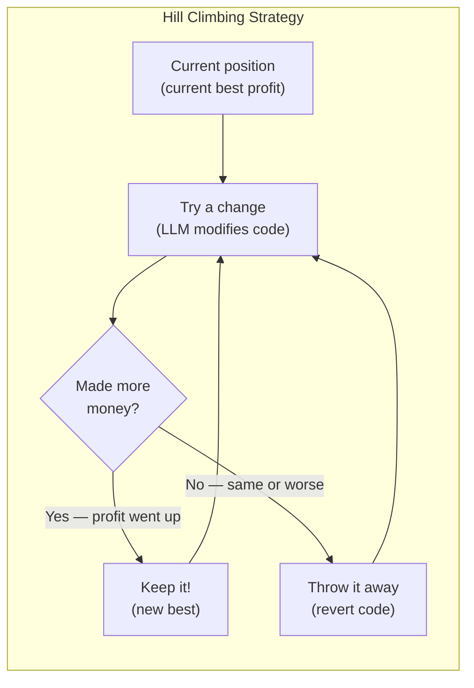

# AutoResearch: A Complete Guide for Beginners

> **What is this?** A deep-dive into Andrej Karpathy's "autoresearch" technique —
> an approach that lets an AI agent autonomously run machine learning experiments
> while you sleep. This guide explains every concept from first principles,
> using a **SPY stock trading** example you can run on any laptop.

---

## Table of Contents

1. [The Problem Autoresearch Solves](#1-the-problem-autoresearch-solves)
2. [Core Concepts](#2-core-concepts)
3. [Our Example: AI Stock Trader](#3-our-example-ai-stock-trader)
4. [Architecture Overview](#4-architecture-overview)
5. [The Experiment Loop — Step by Step](#5-the-experiment-loop--step-by-step)
6. [File Roles and Boundaries](#6-file-roles-and-boundaries)
7. [The Clean Slate Principle](#7-the-clean-slate-principle)
8. [Git as a Version Control Safety Net](#8-git-as-a-version-control-safety-net)
9. [The Role of the LLM](#9-the-role-of-the-llm)
10. [The Visual Dashboard](#10-the-visual-dashboard)
11. [Hill Climbing: The Optimization Strategy](#11-hill-climbing-the-optimization-strategy)
12. [Key Design Decisions and Why They Matter](#12-key-design-decisions-and-why-they-matter)
13. [Running the Project](#13-running-the-project)
14. [Glossary](#14-glossary)
15. [Further Reading](#15-further-reading)

---

## 1. The Problem Autoresearch Solves

Imagine you're building an AI that trades stocks. You have a strategy, but
it needs tuning. Should the model be bigger or smaller? Should it learn
faster or slower? Should it pay more attention to volume or price momentum?

The traditional approach:

1. You have an idea ("what if I look at volume spikes?")
2. You change the code
3. You run the experiment (~10 seconds to train)
4. You check the profit
5. You decide what to try next
6. You repeat

This is **slow** because you can only focus on one thing at a time.
After 5-10 attempts you get tired, distracted, or run out of ideas.

**Autoresearch hands this entire job to an AI agent.** You go to sleep,
and it runs 100+ experiments overnight, each time trying something
different and keeping only the improvements.



**Speed difference:** You do ~5-10 experiments per day.
The AI agent does ~12 per hour, ~100+ overnight.

---

## 2. Core Concepts

### What is a Neural Network?

Think of a neural network as a **decision-making machine** with thousands
of tiny knobs. You show it examples of past market data and what happened
next (price went up or down). It slowly adjusts its knobs until it gets
better at guessing the right answer.

In our project: the neural network looks at 10 market signals (like
yesterday's return, volume changes, moving averages) and outputs a
prediction: **"I think the price will go UP"** or **"I think it will go DOWN."**

### What is a Metric?

A **metric** is a single number that tells you how good your strategy is.
In autoresearch, everything revolves around **one metric**:

| Project | Metric | Better means... |
|---------|--------|----------------|
| Karpathy's autoresearch | `val_bpb` (bits per byte) | Lower |
| **Our SPY trader** | **`val_profit` (% return)** | **Higher** |

Our metric is very intuitive: you start with $10,000. After the AI trades
for a simulated period, how much money did it make (or lose)?
**+15% means you turned $10,000 into $11,500.**

### What are Hyperparameters?

Hyperparameters are the **settings** you choose before training. They're
like the knobs on a mixing board — the AI agent experiments with turning
them to find the best combination:

| Hyperparameter | What it controls | Trading analogy |
|----------------|-----------------|-----------------|
| Learning rate | How quickly the model adapts | How fast you adjust your strategy after a win/loss |
| Hidden size | How complex the model's "brain" is | How many factors you consider before each trade |
| Num layers | How deep the reasoning goes | How many steps of analysis before deciding |
| Batch size | How many examples it looks at per step | How many past days you review at once |
| Activation | The mathematical function between layers | The type of pattern-matching used |

### What is a Time Budget?

Every experiment runs for a **fixed amount of time**:
- Karpathy's version: **5 minutes** per experiment
- Our version: **10 seconds** per experiment

This ensures every experiment is a **fair comparison**. A model that
trained for 10 minutes might beat one that trained for 10 seconds,
but that doesn't mean it's a better architecture — it just trained longer.

---

## 3. Our Example: AI Stock Trader

### The Scenario

You're building an AI that trades **SPY** (the S&P 500 ETF). Every day,
it looks at market data and decides: **BUY** (go long) or **STAY OUT**.



### The Data

The data is **synthetic** (computer-generated) but realistic. It mimics
real SPY price behavior with **hidden patterns** that the AI can learn:

| Pattern | Description | How it works |
|---------|-------------|-------------|
| **Mean reversion** | After a big move (>2%), price tends to reverse | The AI can learn to sell after spikes |
| **Momentum** | 3 consecutive up/down days tend to continue | The AI can learn to follow trends |
| **Volume signals** | Volume spikes often precede reversals | The AI can learn to watch volume |
| **Volatility clustering** | Big moves cluster together | The AI can learn risk patterns |

Why synthetic data? Real stock data is nearly random — a neural network
can't reliably beat the market (if it could, everyone would be rich).
Synthetic data with known patterns lets us focus on **learning the
autoresearch technique**, not debating market efficiency.

### How Trading Simulation Works



### What the AI Agent Optimizes

The agent doesn't trade. Instead, it **modifies the trading bot's code**
to make it trade better. It might:

- Increase the number of neurons (more brain power)
- Change the learning rate (how fast the bot adapts)
- Switch activation functions (different pattern-matching approach)
- Add momentum to the optimizer (smoother learning)
- Add regularization (prevent overfitting to past data)
- Restructure the architecture entirely

After each modification, the bot is retrained and tested. If it makes
more profit → **keep the change**. If not → **revert it**.

---

## 4. Architecture Overview



### The Four Domains

| Domain | Who controls it | Changes during run? |
|--------|----------------|-------------------|
| **Human** | You | Only between sessions (edit `program.md`) |
| **AI Agent** | The LLM (Claude) | Every experiment (rewrites `train.py`) |
| **System** | The orchestrator | Automatic (git, logs, dashboard) |
| **Experiment** | Mix | `train.py` changes; `prepare.py` never changes |

---

## 5. The Experiment Loop — Step by Step

This is the heart of autoresearch. The dashboard shows which phase is
active with a highlighted indicator:

```
 READ → PROMPT → LLM → APPLY → RUN → EVALUATE → DECIDE
```

Here's the complete flow:



### Detailed Walkthrough

#### Phase 1: Clean Slate

Before anything runs, the system resets to a known starting point:
- `train.py` is restored from `train_baseline.py` (the original code)
- `results.tsv` is deleted (no stale history)
- A fresh git commit marks the start

This means **every run is independent**. You always start from the same
baseline, so results are reproducible.

#### Phase 2: Baseline

Run the unmodified trading bot to establish a starting profit. This is
your **control** — the number to beat. A typical baseline might be:

```
val_profit=1.13        ← made 1.13% profit
val_accuracy=47.7      ← correctly predicted direction 47.7% of the time
val_trades=42          ← entered 42 trades
val_final_capital=$10112.85  ← turned $10,000 into $10,112
```

#### Phase 3: READ

The orchestrator reads three files to prepare the context:
- **`train.py`** — the current trading bot code (best version so far)
- **`program.md`** — the rules and goals
- **`results.tsv`** — what was tried before and whether it worked

#### Phase 4: PROMPT

All three files are packaged into a prompt. The dashboard's
**"What We Sent to the LLM"** panel shows a summary:

```
Context sent to LLM:

Files: program.md + train.py + prepare.py

Current hyperparams:
  Hidden size: 16
  Layers: 1
  Learning rate: 0.01
  Batch size: 32
  Activation: tanh

Best profit so far: +1.1%
Past experiments: 3

Goal: "Maximize val_profit (% return on SPY trades)"
```

#### Phase 5: LLM

The LLM reads everything and reasons about what to try next. The
**"LLM Reasoning"** panel shows its thinking:

> "The current model is quite small with only 16 hidden units and 1 layer.
> With 10 input features, a larger hidden layer might capture more complex
> interactions between signals. I'll increase to 48 neurons and add a
> second layer for deeper pattern recognition."

It then outputs the complete, modified `train.py`.

#### Phase 6: APPLY

The new code is written to `train.py` and committed to git. The
**"Code Changes (diff)"** panel shows exactly what changed:

```diff
- HIDDEN_SIZE = 16
+ HIDDEN_SIZE = 48
- NUM_LAYERS = 1
+ NUM_LAYERS = 2
```

#### Phase 7: RUN

The modified trading bot trains for 10 seconds, then evaluates itself
on the validation data (market data it hasn't seen during training).

#### Phase 8: EVALUATE + DECIDE

Three possible outcomes:

| Outcome | What happened | Dashboard shows | Action |
|---------|--------------|-----------------|--------|
| **Crash** | Code has a bug | ⚠ CRASH in red | Revert to previous code |
| **Worse** | Profit didn't improve | ✗ DISC in yellow | Revert to previous code |
| **Better** | Profit increased! | ✓ KEEP in green | Keep the change, update chart |

#### Phase 9: Log and Repeat

Every experiment is logged regardless of outcome. The LLM sees this
history in the next iteration, helping it avoid repeating failed
approaches.

---

## 6. File Roles and Boundaries



### Why only one mutable file?

| Reason | Explanation |
|--------|-------------|
| **Fits in LLM context** | The LLM can read the entire file (~130 lines). No confusion about what code is where. |
| **Diffs are reviewable** | After a run, one `git diff` shows every change the agent made. |
| **Limits blast radius** | The agent can't break the evaluation, data generation, or dashboard. |
| **Fair comparisons** | Since `prepare.py` never changes, all experiments are measured the same way. |

### File-by-File Detail

#### `program.md` — The Job Description

Written by you. Tells the AI agent:
- **Goal:** maximize `val_profit` (percentage return on SPY trades)
- **What it can change:** architecture, hyperparameters, features, strategy
- **What it must NOT change:** evaluation, output format, imports
- **Available features:** the 10 market signals it can use
- **Strategy hints:** data has mean reversion, momentum, volume signals

#### `prepare.py` — The Judge

Contains everything that must stay constant:
- **Market data generation:** 600 days of synthetic SPY prices with hidden patterns
- **Feature engineering:** computes 10 signals from raw price/volume data
- **Train/val split:** 70% for training, 30% for testing (the AI never sees test data during training)
- **Trading simulation:** simulates buying/selling based on model signals
- **Evaluation:** computes profit, accuracy, number of trades, final capital
- **Time budget:** enforces the 10-second limit

#### `train.py` — The Trading Bot (The "Genome")

This is the file the AI agent "evolves." It contains:
- **The neural network architecture:** how many layers, how many neurons
- **The training logic:** how the model learns from historical data
- **Hyperparameters:** learning rate, batch size, activation function

Think of it as **DNA** — the agent mutates it each experiment, and
natural selection (the profit metric) decides if the mutation survives.

#### `train_baseline.py` — The Reset Point

An **exact copy** of the original `train.py`. Every new run restores
`train.py` from this file, ensuring a clean starting point. This file
is never modified.

#### `dashboard.py` — The Visual Dashboard

The full-screen TUI that shows everything in real time:
- SPY price chart with buy/sell signals
- Profit history across experiments
- What was sent to the LLM
- The LLM's reasoning
- Code diff of what changed
- Experiment log with color-coded results

#### `run.py` — The Text-Mode Orchestrator

A simpler, text-only version of the loop (no TUI). Useful for running
overnight or in environments without rich terminal support.

#### `results.tsv` — The Lab Notebook

A tab-separated log of every experiment:

```
step  commit   val_profit  status    description
0     9a04b76  1.13        baseline  Initial baseline
1     a3f2c81  -2.40       discard   Changed LEARNING_RATE = 0.01 -> 0.05
2     b7d1e93  8.75        keep      Changed HIDDEN_SIZE = 16 -> 48
3     c4a9f02  5.20        discard   Changed ACTIVATION = "tanh" -> "relu"
4     d8e3b17  15.30       keep      Add momentum to SGD optimizer
```

This history is **fed back to the LLM** so it can learn from past
attempts. Notice how most experiments are discarded — only the ones
that improve profit survive.

---

## 7. The Clean Slate Principle

Every run starts from scratch. This is a deliberate design choice:



### Why Reset Every Time?

| Reason | Explanation |
|--------|-------------|
| **Reproducibility** | Every run starts from the same point, so results are comparable |
| **No stale context** | Old results from a different run don't confuse the LLM |
| **Fair comparison** | You can compare "10-step run" vs "20-step run" knowing both started identically |
| **Clean experimentation** | If a run goes badly, just restart — no manual cleanup needed |

---

## 8. Git as a Version Control Safety Net

Git acts as an **undo button** that makes the entire process safe.
Every experiment is committed before it runs, so bad changes can
always be reversed:



### How Git is Used

| Action | When | Example |
|--------|------|---------|
| **Commit before running** | After LLM modifies `train.py` | `experiment 3: add momentum` |
| **Revert if bad** | When profit doesn't improve | `revert experiment 3: no improvement` |
| **Keep if good** | When profit increases | Commit stays as-is |
| **Reset on new run** | Start of each session | `clean slate: reset for new run` |

### Why Git and Not Just "Save a Backup"?

- **Full history** — see every experiment the agent tried
- **Clean reverts** — undo exactly one change, atomically
- **Human review** — `git log --oneline` shows the full session
- **Branching** — Karpathy uses `autoresearch/mar5` style branches per session

---

## 9. The Role of the LLM

The LLM (Claude) is the "brain" that decides **what to try next**.
This is what separates autoresearch from randomly guessing.



### LLM vs. Random Search (Demo Mode)

| Approach | How it picks changes | Pro | Con |
|----------|---------------------|-----|-----|
| **Demo mode** | Roll dice on hyperparameters | Free, no API key | Blind — doesn't learn from failures |
| **LLM mode** | Reads code + history, reasons | Intelligent, adaptive, creative | Costs API credits |

The LLM can do things random search can't:
- **Restructure** the model architecture entirely
- **Add new techniques** like momentum, learning rate schedules, weight decay
- **Learn from failure**: "relu crashed last time, tanh worked — let me try sigmoid"
- **Make coordinated changes**: increase model size AND reduce learning rate together

### What the LLM Prompt Looks Like

```
┌─────────────────────────────────────────────────┐
│  "You are an autonomous ML research agent.       │
│   Your job is to modify train.py to maximize     │
│   val_profit (% return from SPY trading)."       │
│                                                  │
│  [Contents of program.md — the rules]            │
│  [Contents of train.py — current trading bot]    │
│  [Contents of prepare.py — how it's evaluated]   │
│  [Contents of results.tsv — past experiments]    │
│                                                  │
│  "Current best val_profit: +8.7%                 │
│   Propose your next modification."               │
│                                                  │
│  ─────────────────────────────────────────────── │
│                                                  │
│  LLM responds:                                   │
│  "DESCRIPTION: Add weight decay regularization   │
│                                                  │
│   The model might be overfitting to noise in     │
│   the training data. Weight decay penalizes      │
│   large weights, forcing the model to find       │
│   simpler, more generalizable patterns."         │
│                                                  │
│  ```python                                       │
│  [complete new train.py]                         │
│  ```                                             │
└─────────────────────────────────────────────────┘
```

---

## 10. The Visual Dashboard

The dashboard (`dashboard.py`) gives you a real-time view of everything
happening during the autoresearch loop. It's a full-screen terminal
application built with the [Rich](https://github.com/Textualize/rich) library.

### Dashboard Layout

```
┌─────────────────────────────────────────────────────────────────────┐
│  AutoResearch SPY Trader │ Step 5/10 │ Best: +15.3% │ Acc: 58%    │
│  │ $11,530 │ LLM │ Running experiment 5...                        │
├─────────────────────────────────────────────────────────────────────┤
│  READ → PROMPT → ▶ LLM → APPLY → RUN → EVALUATE → DECIDE         │
├────────────────────────────┬────────────────────────────────────────┤
│                            │                                        │
│  SPY Validation Period     │  What We Sent to the LLM               │
│  ───── Buy/Sell Signals    │  Files: program.md + train.py +        │
│                            │         prepare.py                     │
│  $485│      ─▲─            │  Current hyperparams:                  │
│      │    ─▲   ▼─          │    Hidden size: 48                     │
│      │  ─▲       ▼─ ─▲    │    Layers: 2                           │
│  $460│─▼           ▼▲  ▼  │    Learning rate: 0.01                  │
│      │                  ▼  │  Best profit: +15.3%                   │
│  $440│                     │  Past experiments: 4                    │
│      └─────────────────    │                                        │
│      Day 1        Day 174  ├────────────────────────────────────────┤
│      ─ price ▲ BUY ▼ OUT  │                                        │
│                            │  LLM Reasoning                         │
├────────────────────────────┤  "The model overfits training data.    │
│                            │   Adding L2 weight decay (0.001)       │
│  Profit History (%)        │   should help it generalize to the     │
│    0 │ ██████ +1.1% ◆     │   validation period..."                │
│    1 │ ░░ -2.4%            │                                        │
│    2 │ ████████████ +8.7%✓ ├────────────────────────────────────────┤
│    3 │ ░░░░░░░ +5.2%      │                                        │
│    4 │ ██████████████+15.3✓│  Code Changes (diff)                   │
│                            │  - HIDDEN_SIZE = 16                    │
│  █ base █ keep ░ discard   │  + HIDDEN_SIZE = 48                    │
│                            │  + WEIGHT_DECAY = 0.001                │
│                            │                                        │
│                            ├────────────────────────────────────────┤
│                            │  Experiment Log                        │
│                            │  # │ Profit  │ Status  │ Description   │
│                            │  0 │  +1.1%  │ ◆ BASE  │ Baseline      │
│                            │  1 │  -2.4%  │ ✗ DISC  │ lr=0.05       │
│                            │  2 │  +8.7%  │ ✓ KEEP  │ hidden=48     │
│                            │  3 │  +5.2%  │ ✗ DISC  │ relu          │
│                            │  4 │ +15.3%  │ ✓ KEEP  │ momentum      │
└────────────────────────────┴────────────────────────────────────────┘
```

### Panel Descriptions

| Panel | What it shows | Why it matters |
|-------|--------------|----------------|
| **Header** | Best profit, accuracy, capital, mode, step | At-a-glance status |
| **Loop Phase** | Which phase is active (highlighted) | See where in the loop you are |
| **SPY Chart** | Price line with ▲ buy / ▼ out markers | Visualize the trading strategy |
| **Profit History** | Bar chart of each experiment's return | See the hill-climbing progress |
| **What We Sent** | Summary of LLM context | Understand what the LLM sees |
| **LLM Reasoning** | Why the LLM made this change | Understand the agent's thinking |
| **Code Changes** | Color-coded diff (green=added, red=removed) | See exactly what was modified |
| **Experiment Log** | Table of all experiments with status | Full history at a glance |

---

## 11. Hill Climbing: The Optimization Strategy

Autoresearch uses **hill climbing** — one of the simplest optimization
strategies. In our trading context, it means: **only keep changes that
make more money**.



### Trading Analogy

Imagine you're a fund manager testing trading strategies:

1. You try a new strategy variation
2. Did it make more money on the test data? → Use this strategy going forward
3. Did it make less or lose money? → Go back to the previous strategy
4. Try another variation

Over time, your strategy only gets better (or stays the same), never worse.

### Visual: Profit Over Time

```
profit
(%)
  │
  │                                          ●  +22.1%  ✓ keep
  │
  │
  │                       ●  +15.3%  ✓ keep
  │
  │
  │          ●  +8.7%  ✓ keep
  │       ○     +5.2%  ✗ discard
  │
  │
  │  ●  +1.1%  Baseline
  │
  ├──○─────────────────────────────────────── experiments →
  │  -2.4%  ✗ discard
  │
  ● = accepted (new best)
  ○ = rejected (reverted)
```

Most experiments are discarded — this is **normal**. In Karpathy's runs,
only a fraction improve the score. The value is in the ones that do.

### Properties of Hill Climbing

| Property | What it means for trading |
|----------|-------------------------|
| **Monotonic** | Your best profit can only go up, never down |
| **Greedy** | Only keeps immediate improvements — won't accept a temporary loss |
| **Local optima** | Might get stuck on "good enough" and miss "great" |
| **Simple** | Just one comparison: `new_profit > best_profit` |

---

## 12. Key Design Decisions and Why They Matter

### Decision 1: Fixed Time Budget (10 seconds)

**What:** Every experiment trains for exactly 10 seconds.

**Why:** Without this, a model that trains for 5 minutes would beat one that
trains for 10 seconds — but that doesn't mean it's a better architecture.
The fixed budget forces the agent to find approaches that learn *faster*.

### Decision 2: One File Constraint

**What:** The agent can only edit `train.py`. Everything else is locked.

**Why:**
- Prevents the agent from gaming the evaluation (modifying `prepare.py`
  to report fake profits)
- Makes changes reviewable — one `git diff` shows everything
- The entire file fits in the LLM's context window

### Decision 3: Complete File Output (Not Diffs)

**What:** The LLM outputs the *entire* new `train.py`, not a patch.

**Why:** LLMs are better at generating complete, coherent files than
correct diffs. A diff might miss a bracket or reference a wrong line.
A complete file is self-consistent.

### Decision 4: No Human Intervention During Runs

**What:** The agent never pauses to ask "should I try this?"

**Why:** The human might be asleep. The whole point is **overnight
autonomy**. The agent decides on its own, and you review in the morning.

### Decision 5: Clean Slate on Every Run

**What:** Each run restores `train.py` to baseline and clears results.

**Why:** This ensures reproducibility. You can compare different sessions
knowing they all started from the same point. No accumulated cruft from
previous experiments leaking into new runs.

### Decision 6: Synthetic Data with Known Patterns

**What:** We use computer-generated market data instead of real SPY data.

**Why:** Real stock data is nearly random — a neural network can't
reliably beat an efficient market. Synthetic data with embedded patterns
(mean reversion, momentum, volume signals) lets the AI agent actually
discover and exploit these patterns, making the demo educational and
engaging. The focus is on learning the autoresearch technique, not on
building a real trading system.

---

## 13. Running the Project

### Prerequisites

- **Python 3.9+** (any recent version)
- **uv** (package manager) — install with `curl -LsSf https://astral.sh/uv/install.sh | sh`
- **Git** — for version control
- **Anthropic API key** (optional) — for LLM mode; demo mode works without it

### Setup

```bash
# Clone or navigate to the project
cd autoresearch-intro-guide

# Install dependencies (uv handles the virtual environment automatically)
uv sync
```

### Running the Visual Dashboard

```bash
# Demo mode — random tweaks, no API key needed
uv run python dashboard.py --demo --max-steps 10

# LLM mode — intelligent, reasoned modifications
export ANTHROPIC_API_KEY="your-key-here"
uv run python dashboard.py --max-steps 20
```

### Running the Text-Mode Orchestrator

```bash
# Simpler output, good for logging or overnight runs
uv run python dashboard.py --demo --max-steps 50
```

### Reviewing Results

```bash
# See experiment log
cat results.tsv

# See git history of all changes
git log --oneline

# See what the last kept experiment changed
git diff HEAD~2 HEAD -- train.py
```

### Project Structure

```
autoresearch-intro-guide/
├── program.md          ← Human-written research instructions
├── prepare.py          ← Fixed: market data + evaluation (DO NOT EDIT)
├── train.py            ← The file the AI agent modifies (trading bot)
├── train_baseline.py   ← Original train.py (for reset)
├── dashboard.py        ← Visual TUI dashboard
├── run.py              ← Text-mode orchestrator
├── README.md           ← This documentation
├── results.tsv         ← Generated experiment log (auto-deleted on reset)
├── pyproject.toml      ← Project config (dependencies)
├── uv.lock             ← Locked dependency versions
└── .gitignore          ← Ignores .venv, __pycache__, results.tsv
```

---

## 14. Glossary

| Term | Definition |
|------|-----------|
| **Activation function** | A mathematical function (tanh, relu, sigmoid) applied between neural network layers. Different functions detect different types of patterns. |
| **Agent** | An AI system that takes actions autonomously — here, it modifies code and runs experiments without human input. |
| **Backpropagation** | The algorithm that calculates how to adjust neural network weights to improve predictions. Like a feedback loop that says "you were wrong by this much, adjust this way." |
| **Baseline** | The initial experiment result before any modifications. The starting profit to beat. |
| **Batch size** | How many trading days the model looks at per learning step. Smaller = noisier but more frequent updates. Larger = smoother but slower. |
| **Binary cross-entropy** | A loss function for yes/no predictions (like "will the price go up?"). Penalizes confident wrong answers more than uncertain ones. |
| **Clean slate** | Resetting to the original state before each run, ensuring reproducibility. |
| **Context window** | The maximum text an LLM can read at once (~100K-1M tokens). Autoresearch keeps files small to fit within this. |
| **Demo mode** | Running without an LLM, using random hyperparameter perturbations instead. Good for understanding the loop mechanics. |
| **Epoch** | One complete pass through all training data. More epochs = more learning time. |
| **Feature** | A piece of information the model uses to make predictions. Example: yesterday's return, current RSI, volume ratio. |
| **Git** | Version control system that tracks every change to files. Acts as an undo button in autoresearch. |
| **Hidden layer** | A layer of neurons between input and output. More hidden layers = deeper reasoning but harder to train. |
| **Hill climbing** | Optimization strategy: only keep changes that immediately improve the metric. Simple but can get stuck. |
| **Hyperparameter** | A setting chosen before training (learning rate, model size, etc.). Not learned from data — set by the researcher or AI agent. |
| **LLM** | Large Language Model (like Claude). An AI that reads and generates text, used here to propose code modifications. |
| **Learning rate** | How aggressively the model adjusts after each example. Too high = unstable, too low = slow. |
| **Metric** | The single number that measures success. Our metric: `val_profit` (higher = better). |
| **Moving average** | Average price over the last N days. Comparing current price to the MA reveals trends. |
| **Neural network** | A model made of layers of connected "neurons" that learns patterns from data. |
| **Orchestrator** | The program (`dashboard.py` or `run.py`) that runs the experiment loop. |
| **Overfitting** | When a model memorizes training data instead of learning general patterns. It performs well on training data but poorly on new data. |
| **Regularization** | Techniques (like weight decay) that prevent overfitting by penalizing model complexity. |
| **Revert** | Undo a code change using git, restoring the previous version. |
| **RSI** | Relative Strength Index — a momentum indicator measuring recent gains vs losses. Values near 0 = oversold, near 100 = overbought. |
| **Sigmoid** | A function that squishes any number into the range 0-1. Used to output probabilities (e.g., "70% chance price goes up"). |
| **SPY** | An ETF (exchange-traded fund) that tracks the S&P 500 index. A common benchmark for stock market performance. |
| **Time budget** | Fixed duration for each experiment (10 seconds), ensuring fair comparison between approaches. |
| **TUI** | Terminal User Interface — a visual interface inside the terminal, like our dashboard. |
| **Validation set** | Market data the model never sees during training, used only to measure real performance. Prevents cheating. |
| **val_profit** | The percentage return achieved on the validation period. Our primary metric: higher = better. |
| **Weight** | A learnable number inside the neural network, adjusted during training to improve predictions. |
| **Weight decay** | A regularization technique that slightly shrinks weights each step, preventing them from growing too large. |

---

## 15. Further Reading

### Autoresearch

- **[Karpathy's autoresearch repository](https://github.com/karpathy/autoresearch)** —
  The original source code and `program.md`
- **[VentureBeat: "Run hundreds of AI experiments a night"](https://venturebeat.com/technology/andrej-karpathys-new-open-source-autoresearch-lets-you-run-hundreds-of-ai)** —
  Accessible overview for non-technical readers
- **[MarkTechPost: "A 630-Line Python Tool"](https://www.marktechpost.com/2026/03/08/andrej-karpathy-open-sources-autoresearch-a-630-line-python-tool-letting-ai-agents-run-autonomous-ml-experiments-on-single-gpus/)** —
  Technical breakdown
- **[Kingy AI: "Karpathy's Minimal Agent Loop"](https://kingy.ai/ai/autoresearch-karpathys-minimal-agent-loop-for-autonomous-llm-experimentation/)** —
  Deep technical analysis
- **[autoresearch-mlx](https://github.com/trevin-creator/autoresearch-mlx)** —
  Apple Silicon port (runs on Mac without NVIDIA GPU)
- **[Karpathy on X about collaborative autoresearch](https://x.com/karpathy/status/2030705271627284816)** —
  His vision for SETI@home-style distributed research agents

### Neural Networks & ML (Beginner-Friendly)

- **[3Blue1Brown: "Neural Networks" (YouTube)](https://www.youtube.com/playlist?list=PLZHQObOWTQDNU6R1_67000Dx_ZCJB-3pi)** —
  Best visual introduction (no math prerequisites)
- **[Andrej Karpathy: "Neural Networks: Zero to Hero" (YouTube)](https://www.youtube.com/playlist?list=PLAqhIrjkxbuWI23v9cThsA9GvCAUhRvKZ)** —
  Build neural networks from scratch, step by step
- **[fast.ai: "Practical Deep Learning for Coders"](https://course.fast.ai/)** —
  Free course — build things first, understand theory later

### Trading & Finance Basics

- **[Investopedia: What is SPY?](https://www.investopedia.com/articles/investing/122215/spy-spdr-sp-500-trust-etf.asp)** —
  Understanding the S&P 500 ETF
- **[Investopedia: RSI Indicator](https://www.investopedia.com/terms/r/rsi.asp)** —
  How the Relative Strength Index works
- **[Investopedia: Moving Averages](https://www.investopedia.com/terms/m/movingaverage.asp)** —
  Understanding moving average crossovers

### LLMs and AI Agents

- **[Anthropic's Claude documentation](https://docs.anthropic.com/)** —
  The LLM that powers our autoresearch agent
- **[Lilian Weng: "LLM Powered Autonomous Agents"](https://lilianweng.github.io/posts/2023-06-23-agent/)** —
  Comprehensive survey of AI agent architectures

### Git Version Control

- **[Git - The Simple Guide](https://rogerdudler.github.io/git-guide/)** —
  Minimal intro if you've never used git
- **[Atlassian Git Tutorials](https://www.atlassian.com/git/tutorials)** —
  Comprehensive, well-illustrated guides

### Related Concepts

- **[AutoML (Wikipedia)](https://en.wikipedia.org/wiki/Automated_machine_learning)** —
  The broader field of automating ML decisions
- **[Hyperparameter optimization](https://en.wikipedia.org/wiki/Hyperparameter_optimization)** —
  Grid search, random search, Bayesian optimization
- **[Neural Architecture Search](https://en.wikipedia.org/wiki/Neural_architecture_search)** —
  Automatically designing neural network structures

---

> **Next steps:** Run `uv run python dashboard.py --demo --max-steps 5` to see the
> loop in action. Then set your `ANTHROPIC_API_KEY` and watch the LLM reason about
> trading strategies, volume signals, and model architecture in real time.
